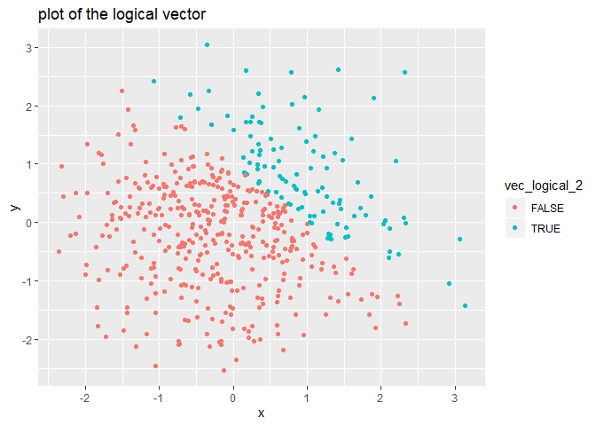
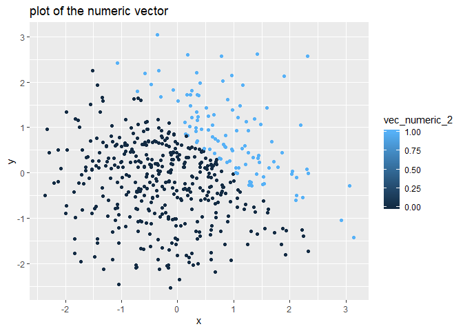

p8105\_hw1\_xl2851
================

# problem 1

## 1.1 create a data frame

``` r
library(tidyverse)
```

    ## -- Attaching packages -------------------------------------- tidyverse 1.2.1 --

    ## √ ggplot2 3.2.1     √ purrr   0.3.2
    ## √ tibble  2.1.3     √ dplyr   0.8.3
    ## √ tidyr   0.8.3     √ stringr 1.4.0
    ## √ readr   1.3.1     √ forcats 0.4.0

    ## -- Conflicts ----------------------------------------- tidyverse_conflicts() --
    ## x dplyr::filter() masks stats::filter()
    ## x dplyr::lag()    masks stats::lag()

``` r
hw1_df = tibble(
  vec_numeric = rnorm(8),
  vec_logical = vec_numeric > 0,
  vec_char=c("a","b","c","d","e","f","g","h"),
  vec_factor=factor(c(0,1,2,0,1,2,0,1), levels=c(0,1,2), labels=c("low", "mediun", "high")))
```

## 1.2 take the mean of each variable

The mean of the vec\_numeric is -0.3975759

The mean of the vec\_logical is 0.375

The mean of the vec\_char is NA

The mean of the vec\_factor is NA

vec\_numeric and vec\_logical can take the mean. vec\_char and
vec\_factor cannot take the mean.

## 1.3 convert

``` r
as.numeric(pull(hw1_df,vec_logical))
as.numeric(pull(hw1_df,vec_char))
```

    ## Warning: Ç¿ÖƸıä¹ý³ÌÖвúÉúÁËNA

``` r
as.numeric(pull(hw1_df,vec_factor))
```

Logical and factor vector can be converted into numeric vector while
character vector cannot. This can explain why character vector can not
take the mean.And this cannot explain why factor vector cannot take the
mean.

## 1.4 second code crunk:convert and multiply

``` r
as.numeric(pull(hw1_df,vec_logical))*(pull(hw1_df, vec_numeric))
as.factor(pull(hw1_df,vec_logical))*(pull(hw1_df,vec_numeric))
```

    ## Warning in Ops.factor(as.factor(pull(hw1_df, vec_logical)), (pull(hw1_df, :
    ## '*' not meaningful for factors

``` r
as.numeric(as.factor(pull(hw1_df,vec_logical)))*(pull(hw1_df,vec_numeric))
```

# problem 2

## 2.1 create a data frame

``` r
hw11_df=tibble(
  x=rnorm(500, mean=0, sd=1),
  y=rnorm(500, mean=0, sd=1),
  vec_logical_2=x+y>1,
  vec_numeric_2=as.numeric(vec_logical_2),
  vec_factor_2=as.factor(vec_logical_2),
)
```

## 2.2 description of the dataset

The size of the dataset is 500 rows and 5 columns.

The mean of x is 0.0155161

The median of x is -0.0132821

The standard deviation of the x is 1.0635028

The proportion of cases for which x+y\>1 is
0.288

## 2.3 plots

### 2.3.1 plot of the logical variable(vec\_logical\_2)

``` r
plot_logical=ggplot(hw11_df, aes(x=x, y=y, color=vec_logical_2))+ geom_point()
print(plot_logical + ggtitle("plot of the logical vector"))
```

<!-- -->

``` r
ggsave("scatter_plot.pdf", height = 4, width = 6)
```

If “x+y\>1” is true, the dots are in blue. If “x+y\>1” is false, the
dots are in
red.

### 2.3.2 plot of the numeric variable(vec\_numeric\_2)

``` r
plot_numeric=ggplot(hw11_df, aes(x=x, y=y, color=vec_numeric_2))+ geom_point()
print(plot_numeric + ggtitle("plot of the numeric vector"))
```

<!-- -->
When D=0, dots are in dark blue. When D=1, dots are in light
blue.

### 2.3.3 plot of the factor variable(vec\_factor\_2)

``` r
plot_factor=ggplot(hw11_df, aes(x=x, y=y, color=vec_factor_2))+ geom_point()
print(plot_factor + ggtitle("plot of the factor vector"))
```

<!-- --> If
“x+y\>1” is true, the dots are in blue. If “x+y\>1” is false, the dots
are in red.
